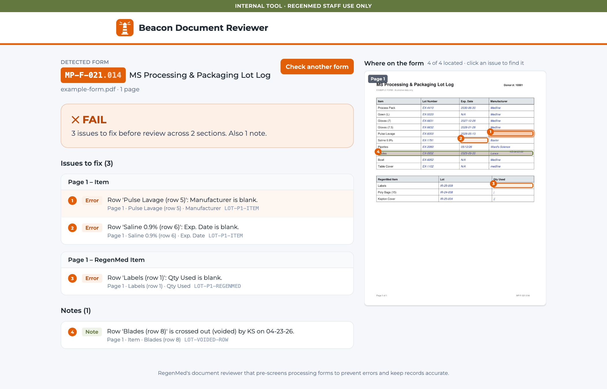
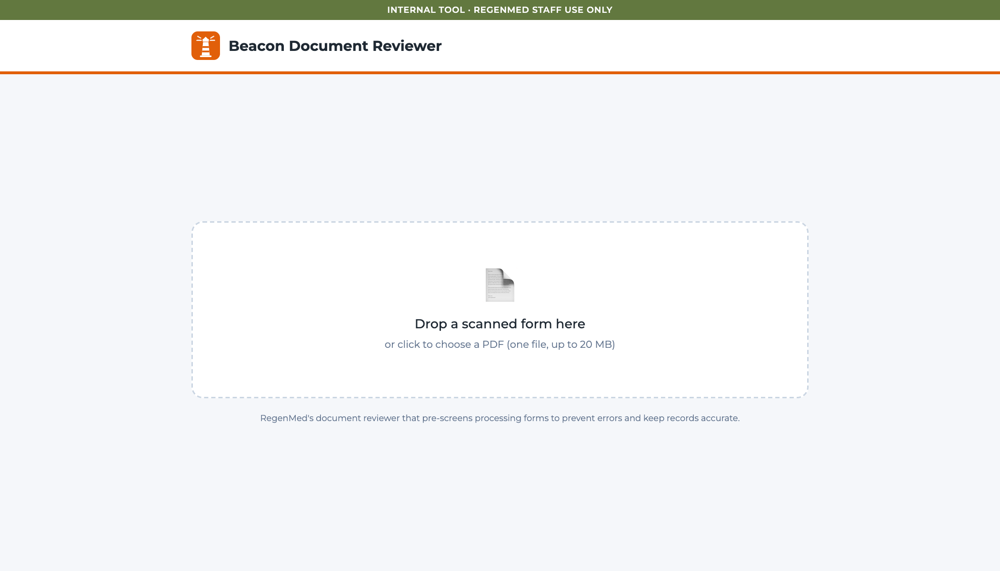
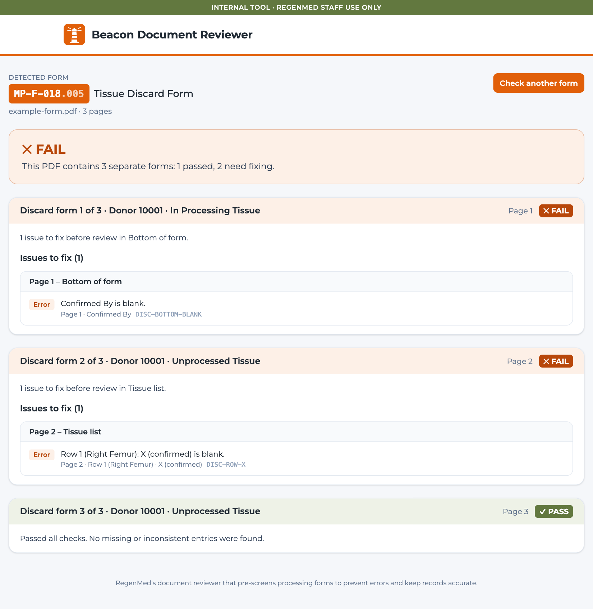
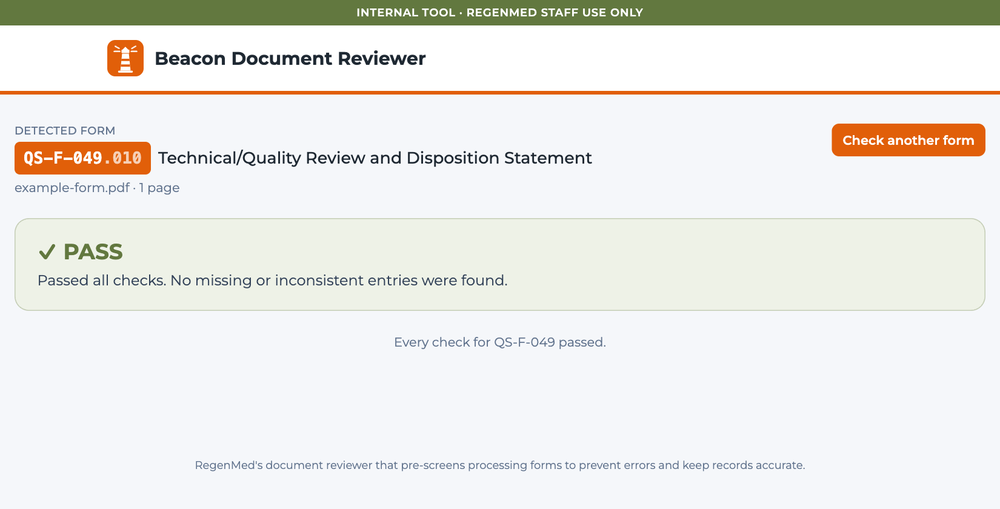
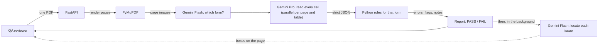
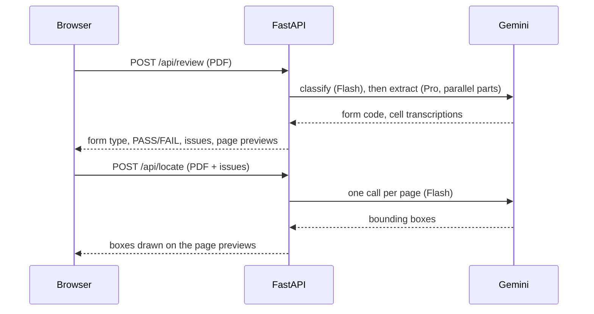

# Beacon Document Reviewer

**A web app that pre-screens a tissue bank's hand-filled processing forms before the two-person quality review.** Upload one scanned PDF and Beacon works out which form it is, reads every box, and lists each missing initial, blank field or bad date by page, section, row and field, with the problem highlighted on the scan.




## The problem

RegenMed, Ontario's not-for-profit musculoskeletal tissue processor, documents every donor on hand-filled forms, many of them completed inside a clean room where tablets aren't practical. Two people review every form before tissue is released. Roughly **half of processing forms come back needing a correction**: a missing initial, a blank field, a date in the wrong format. Reviewers spend their time hunting for blanks instead of applying judgment.

## What it does

- **Detects the form by itself.** Nobody says which form it is. Beacon reads the form code at the bottom-right (with a title fallback) and supports four types: MP-F-023 Tissue Open Checklist, QS-F-049 Technical/Quality Review, MP-F-021 Processing & Packaging Lot Log, and MP-F-018 Tissue Discard Form. Anything else is reported as unsupported.
- **Checks every rule for that form.** Header fields, By/Date sign-offs (initials *and* a date), the Operations Manager review, # Produced / # Packaged, MM/DD/YY dates, INC # → Status, Lot / Exp. Date / Manufacturer / Qty Used on every listed row, Tissue Status vs. Graft IDs, and the X box beside every discarded tissue.
- **Enforces good documentation practice.** Anything crossed out, whether a corrected value or a voided row, must carry initials and a date.
- **Points to the exact spot.** Every issue names the page, section, row and field, and a numbered orange box marks it on the page. Click an issue to jump to it.
- **Separates certainty from doubt.** Clear misses are **errors** and fail the form. Ink the AI can't read, an empty row beside a void, or a repeated item name without a distinguishing label go under **Needs confirmation**, for a person to check.
- **Handles real paperwork.** Several discard forms in one PDF get one card each with its own pass or fail. Pages scanned sideways or upside down are straightened. Faint, noisy, low-resolution scans still read correctly.

| Drop in a scan | Several forms in one PDF | A clean form |
| --- | --- | --- |
|  |  |  |

<sub>Screens use example data. RegenMed's forms are not included in this repository.</sub>

## How it works

**Gemini reads, Python judges.** The AI only transcribes the form into a strict schema. Deterministic, unit-tested rules decide pass or fail, so every result is repeatable and explainable.



A review is two requests, so the result never waits for highlighting:



## Engineering highlights

- **The AI can't decide the outcome.** Gemini returns transcriptions such as `""`, `"N/A"`, `"0"` or `"[illegible]"`. Python turns them into blank / N/A / filled / unreadable and applies the rules. Zero and tally marks count as filled. Unreadable ink is never counted as blank.
- **No silent omissions.** Every field in the extraction schema is required, so the model can't skip a cell and cause a false "blank". A safety net flags any gap in a table's row numbering, so a row the model skipped can't pass unnoticed.
- **Speed through fewer tokens.** Timing logs showed latency was almost entirely output tokens. Each cell is returned as a plain string instead of an object, unused columns are never requested, and dense pages are split into parallel calls. Forms dropped from 30–100 s to about **7–25 s**.
- **Honest about multi-form PDFs.** A PDF holding several discard forms is split by page, and each form is checked and reported on its own.
- **Built for a shared live demo.** Gemini 3.1 Pro allows 25 requests a minute, so on a rate-limit error the client retries once on Gemini Flash, which has its own quota, instead of failing the upload.
- **Tested like a product.** 147 offline tests cover every rule on hand-written JSON with no API calls. A live scorecard runs the real pipeline on 30 PDFs (samples, blank templates, planted errors, sideways, upside-down and faint scans) and compares each to its expected result: **30/30**. A generator makes new test variants by whiting out cells, writing wrong values, ticking extra boxes or degrading the scan.

## Results

| Measure | Result |
| --- | --- |
| Live accuracy scorecard | **30 / 30** PDFs match the expected outcome |
| Planted errors caught | 10 error types, each found exactly, with no false alarms |
| Poor scans | sideways, upside down, faint 72 DPI and noisy scans read correctly |
| Time per form | about 7–25 s (a 3-form discard PDF in about 10 s) |
| Highlight boxes | appear about 3–6 s after the result |

## Tech stack

| Layer | Tools |
| --- | --- |
| Backend | Python 3.12, FastAPI, Uvicorn, Pydantic v2 |
| PDF | PyMuPDF: render pages, straighten rotation, page previews |
| AI | Gemini API through `google-genai`: Gemini 3.1 Pro reads the forms, Gemini 3.5 Flash detects the form, locates issues and backs up Pro when it's rate-limited |
| Frontend | React, Vite, TypeScript, Tailwind CSS v4 |
| Tests | pytest (offline rule tests, live scorecard), ruff |
| Deploy | Docker (multi-stage) on Google Cloud Run, key in Secret Manager, GitHub Actions CI |

## Project structure

```
app/
  main.py            API: POST /api/review, POST /api/locate, GET /api/health, serves the UI
  pipeline.py        render → classify → extract (parallel) → rules → report; issue locating
  pdf_utils.py       Upload checks, page rendering, rotation, previews
  gemini_client.py   Strict JSON-schema calls, retry, timeout, rate-limit fallback
  prompts/           Classify, locate, and one extraction prompt per form
  schemas/           Pydantic models: shared cells and results, one schema per form
  rules/             Pure rule functions per form, shared helpers, form registry
frontend/src/        React app: upload, progress, report, page preview with issue boxes
tests/               Rule tests, pipeline tests with a fake Gemini client, variant generator
scripts/             review_pdf.py (command-line review), scorecard.py (live accuracy check)
docs/
  RULES.md           Every check in plain English
  ARCHITECTURE.md    Pipeline, AI calls, configuration
  DECISIONS.md       Decision log (ADRs)
  DEPLOY.md          Cloud Run deployment and operations
  USER_GUIDE.md      Using the app and reading results
  BUSINESS_CASE.md   The problem, value model and measures
  PROJECT_PLAN.md    Phases, backlog, how it was judged
  sprints/           A report for every sprint
```

## Running your own copy

You need Python 3.12, Node.js and a [Gemini API key](https://aistudio.google.com/apikey) with billing enabled (the free tier has no Pro quota).

```bash
uv venv --python 3.12 .venv && source .venv/bin/activate
uv pip install -r requirements-dev.txt
cp .env.example .env                        # add GEMINI_API_KEY and GEMINI_MODEL
cd frontend && npm install && npm run build && cd ..
uvicorn app.main:app --port 8080            # open http://localhost:8080
pytest -m "not live"                        # offline tests, no API key needed
```

To deploy on Google Cloud Run, follow [docs/DEPLOY.md](docs/DEPLOY.md). To measure accuracy, add PDFs to `tests/fixtures/samples/` with matching `tests/fixtures/expected/*.json` and run `python -m scripts.scorecard`.

## Status

A hackathon prototype built in one day for the RegenMed (Lake Superior Centre for Regenerative Medicine) Internal Document Reviewer challenge, where it was named **runner-up**. It assists, and does not replace, the two-person review, and it isn't validated for production use.

## About

Built by [@fikokwu](https://github.com/fikokwu) and [@oadep-source](https://github.com/oadep-source) (Omolayo) for the RegenMed hackathon challenge.
